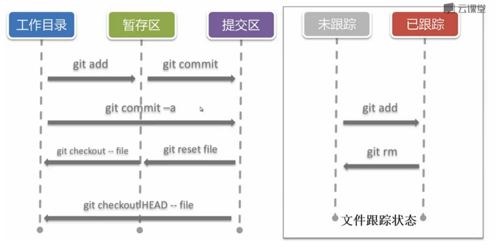
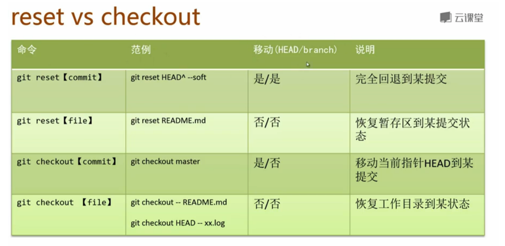

git help <command>
git <command> -h 
git <command> --help

git config
配置级别
--local 默认 只影响本仓库
--global
--system  

初始化仓库
git init
git init [path]
git init [path] --bare

git status  

untracked files:

git add fileName
git add * 

.gitignore
*.logs
*.pids
lib-cov
build/Release
.swp
!a.swap

从暂存区删除git-rm
git rm --cached  ：仅从暂存区删除  
git rm           : 从暂存区与工作目录删除  
git rm $(git ls-files --deleted)  删除所有被跟踪，但是在工作目录被删除的文件  

git commit     : 暂存区 到 提交区  

直接提交
git commit -a -m 'full commit'
: 会丢失提交信息。  

git log 
git log --graph --all   

git alias  
git config alias alias.shortname <fullcommand>
git config --global alias.lg "log --color --graph --pretty=format: '%Cred%h%Creset -%C(yellow)%d%Creset %s %Cgreen(%cr) %C(boldblue)<%an>%Creset' --abbrev-commit"

git diff 
git diff      : 工作目录与暂存区的差异  
git diff --cached[<reference>]  : 暂存区与某次提交差异，默认为HEAD  
git diff <reference>   : 工作目录与某次提交的差异  
eg:
git diff da676

撤销本地修改  
git checkout --<file>   : 将文件内容从暂存区复制到工作目录

git reset HEAD <file>  : 将文件内容从上次提交复制到暂存区  

git checkout HEAD --<file> : 将内容从上次提交复制到工作目录  

;  

git branch  
git branch <branchName>
git branch -d <branchName>
git branch -v  

git checkout :通过移动HEAD检出版本，可用于分支切换  
git checkout <branchName>
git checkout -b <branchName>

git reset    :将当前分支回退到历史某个版本  
git reset --mixed <commit> (默认)
git reset --soft <commit>
git reset --hard <commit>
eg:
git reset --mixed e399b2

git reflog  

reset&checkout  
;  

git stash  :保存目前的工作目录和暂存区状态，并返回到一个更近的工作空间  
git stash save 'push to stash area'  
git stash list  
git stash apply stash@{0}
git stash drop stash@{0}

stash pop = stash apply + stash drop  

git merge  
git cat-file -p HEAD  
git merge next master  

git rebase     : 修剪提交历史基线，俗称"变基"  
git rebase --onto master j3i3oi
勿在公有分支使用rebase  

git tag    : 对某个提交设置一个不变的别名  

git checkout v0.1  

第一次提交  
git push /Users/leeluolee/git-server master  

git remote  
git remote add origin ~/git-server
git remote -v  

git push origin master 
git fetch origin master
git merge origin/master  
git pull = git fetch + git merge  

git clone = git init + git remote + git pull  

