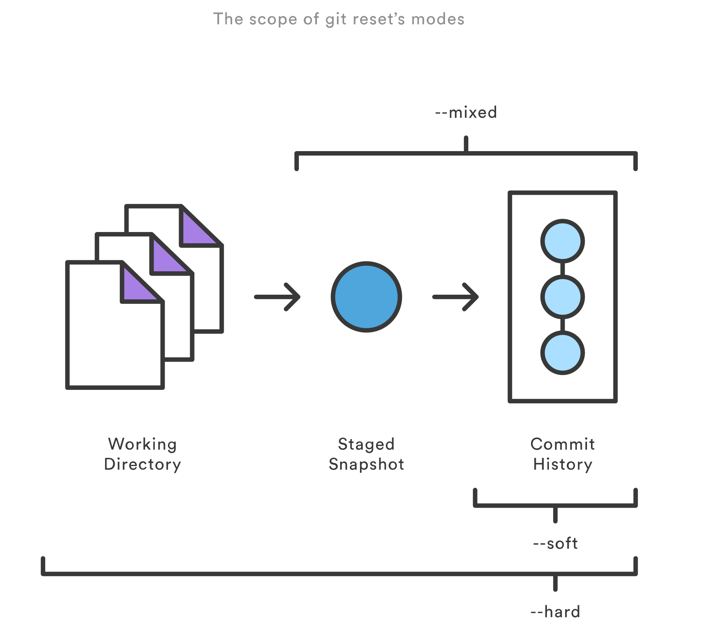

# 基本概念：
正常流程：
  git add .  //把所有文件放入暂存区  
  git commit -m "comment"  把所有文件从暂存区提交进本地仓库；  
  git push 把所有文件从本地仓库推送进远程仓库。  

Start a new Git repository for an existing code base  
$ cd /path/to/my/codebase  
$ git init      (1)  
$ git add .     (2)   
$ git commit    (3)  

而只要知道有这么 4 个区就够了：  
* 工作区( Working Area )  
* 暂存区( Stage )  
* 本地仓库( Local Repository )  
* 远程仓库( Remote Repository )  

5 种状态分别命名为：  
* 未修改( Origin )  
* 已修改( Modified )  
* 已暂存( Staged )  
* 已提交( Committed )  
* 已推送( Pushed )  

# 检查修改  
犯错误之后如何撤销的问题。  
首先，我们要了解如何检查这 3 个步骤当中每一个步骤修改了什么，然后才好判断有没有修改成功。  
检查修改的二级命令都相同，都是 diff ，只是参数有所不同。  

情况1：  
已修改，未暂存   
git diff  
情境：  
如果我们只是简单地在浏览器里保存了一下文件，但是还没有做 git add . 之前，我们如何检查有哪些修改。  
这时文件进入了 已修改 状态，但是还没有进入 暂存区 ，我们运行 git diff ，结果如下：  
diff --git a/index.md b/index.md
index 73ff1ba..1066758100644
--- a/index.md
+++ b/index.md
@@-1,5+1,5@@
---
-layout: main
+1234layout: main
 color: black
---  

情况2： 
已暂存，未提交  
git diff --cached  
git diff 这个命令只检查我们的 工作区 和 暂存区 之间的差异，如果我们想看到 暂存区 和 本地仓库 之间的差异，  
就需要加一个参数 git diff —cached ：  

情况3：  
已提交，未推送  
git diff master origin/master  
在这里， master 就是你的 本地仓库 ，而 origin/master 就是你的 远程仓库 ，  
master 是主分支的意思，因为我们都在主分支上工作，所以这里两边都是 master ，而 origin 就代表远程。  

# 撤销修改  

基础知识  
代码回滚：git reset、git checkout和git revert区别和联系  
提交层面的操作  
你传给git reset和git checkout的参数决定了它们的作用域。  
如果你没有包含文件路径，这些操作对所有提交生效。我们这一节要探讨的就是提交层面的操作。  
注意，git revert没有文件层面的操作。  
Reset
在提交层面上，reset将一个分支的末端指向另一个提交。这可以用来移除当前分支的一些提交。  
比如，下面这两条命令让hotfix分支向后回退了两个提交。  
git checkout hotfix
git reset HEAD~2
hotfix分支末端的两个提交现在变成了悬挂提交。也就是说，下次Git执行垃圾回收的时候，这两个提交会被删除。  
换句话说，如果你想扔掉这两个提交，你可以这么做。  
如果你的更改还没有共享给别人，git reset是撤销这些更改的简单方法。  
当你开发一个功能的时候发现『糟糕，我做了什么？我应该重新来过！』时，reset就像是go-to命令一样。  
  
这些标记往往和HEAD作为参数一起使用。比如，git reset --mixed HEAD 将你当前的改动从缓存区中移除，但是这些改动还留在工作目录中。  
另一方面，如果你想完全舍弃你没有提交的改动，你可以使用git reset --hard HEAD。这是git reset最常用的两种用法。  
当你传入HEAD以外的其他提交的时候要格外小心，因为reset操作会重写当前分支的历史。正如Rebase黄金法则所说的，在公共分支上这样做可能会引起严重的后果。

各种撤销操作  
情况1：  
已修改，未暂存  
如果我们只是在编辑器里修改了文件，但还没有执行 git add . ，这时候我们的文件还在工作区 ，并没有进入暂存区 ，我们可以用：  
git checkout .  
或者  
git reset --hard   
来进行撤销操作。  

情况2：  
已暂存，未提交  
你已经执行了 git add . ，但还没有执行 git commit -m “comment” 。这时候你意识到了错误，想要撤销，你可以执行：
git reset  
git checkout .   
或者  
git reset --hard  
git reset 只是把修改退回到了 git add . 之前的状态，也就是说文件本身还处于 已修改未暂存 状态，你如果想退回 未修改 状态，还需要执行 git checkout . 。  
或许你已经注意到了，以上两个步骤都可以用同一个命令 git reset —hard 来完成。  
是的，就是这个强大的命令，可以一步到位地把你的修改完全恢复到 未修改 的状态。  
**当你传入HEAD以外的其他提交的时候要格外小心，因为reset操作会重写当前分支的历史。正如Rebase黄金法则所说的，在公共分支上这样做可能会引起严重的后果**  

情况3：  
已提交，未推送  
git reset --hard origin/master  
还是这个 git reset —hard 命令，只不过这次多了一个参数 origin/master ，正如我们上面讲过的， origin/master 代表 远程仓库 ，既然你已经污染了你的 本地仓库 ，那么就从 远程仓库 把代码取回来吧。  

情况4：  
已推送  
如果你想恢复的话，还好，由于你的 本地仓库 和 远程仓库 是等价的，你只需要先恢复 本地仓库 ，再强制 push 到 远程仓库 就好了：  
git reset --hard HEAD^  
git push -f  

在合并改动之前，你可以使用如下命令预览差异：
git diff <source_branch> <target_branch>
